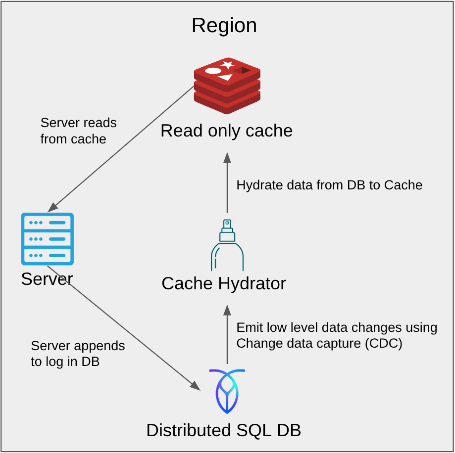
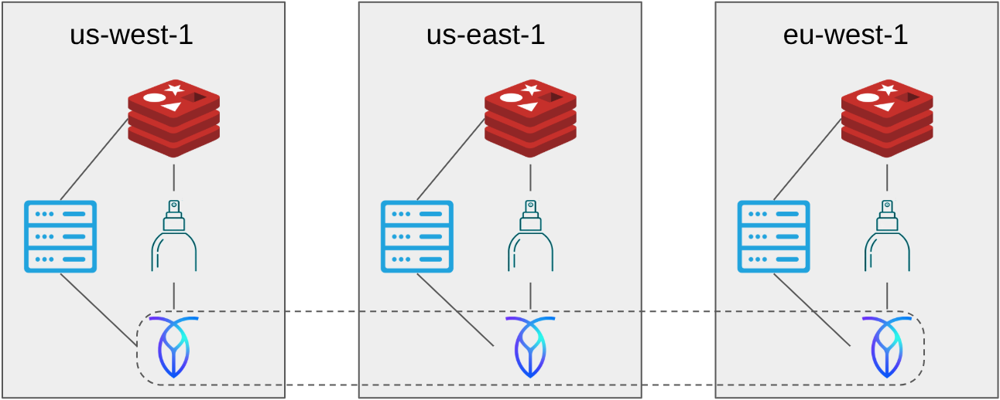

# Run and Test the Project

```
make init               # Initialize the Go Module and Download Dependencies
make compose            # Build the Images and Start the env using podman compose
make test               # Run the comprehensive Go test client (3 regions)
./viewDB <SQL Query>    # Execute SQl queries on all DB replicas. Ex: "./viewDB "SELECT * FROM kv_log;"
./viewCache             # View the Redis Cache of all the Regions
make down               # Stop and remove all the running containers
```

# Architecture Overview

This project is a geo-distributed key-value store that uses a durable database as the source of truth and regional in-memory caches for fast reads. The system is built on a decoupled, event-driven pattern using Change Data Capture (CDC).




## Components

### API Server
A simple Go service that handles client GET, PUT, and DELETE requests. It only writes to the database and reads from the cache.

### CockroachDB
A geo-replicated SQL database that acts as the durable source of truth. All changes are stored as an append-only log.

### Redis Caches
Each region has its own isolated Redis cache for low-latency reads.

### Cache Hydrator
A background service that listens to database changes via CDC and is solely responsible for updating the regional Redis caches.

## How it Works

### Write Path
A write request to any API server is written only to CockroachDB. The database change is then replicated to other regions. The Cache Hydrator service in each region sees this new record via the database's changefeed and updates its local Redis cache accordingly.

### Read Path
A read request first checks the local Redis cache. If the data is present (a cache hit), it's returned immediately. If not (a cache miss), the server reads from its local CockroachDB replica, populates the cache, and then returns the data.
